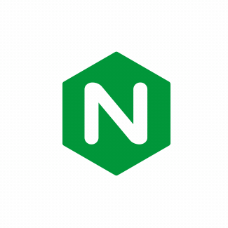

<h1> ⚡ Fullstack Developer   🦅 White Hat   ☁️ Cloud Architect 🏗<h1>
  </img>
 
  <h2>🐲 Skills:</h2> 
 <a href="https://github.com/tobiasalbirosa/registrator"> 
 JS </img> 
 <a>
 <a href="https://github.com/tobiasalbirosa/reflejosandroid"> 
 JAVA </img> 
 <a>
 
  <h3>🌴 Another langauges:</h3> 
 
 Apache   </img>

 
 Nginx   </img>

 
 Python 

 
 PHP  

 
<a href="https://www.linkedin.com/in/tobiasalbirosa/"> Contact: </img>
</a>
